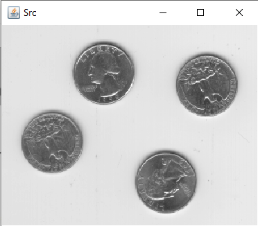

# Morphological Operations

## [MorphologyTest](src/MorphologyTest.java)

Visual Showcase adapted from OpenCV Tutorials Page (Erosion and dilatation demo), that exemplifies how shape and size of a Structuring Element affect the result.

 

## [MorphologyOnImage](src/MorphologyOnImage.java)

This example shows a chain of image processing operations to extract information about simple objects from an image. The targets are:
- obtain binary image from original image by channel reduction and thresholding
- enhance the binary image for object detection and contour finding by applying morphological operations
- finding object contours, bounding rectangle, object area and the biggest object

Steps:


1. Open test image

    ```java
    Mat src = Imgcodecs.imread("./test_images/eight.bmp");
    ```
   
    

2. Convert image to gray (to have 1 chanel only)

    ```java
    Imgproc.cvtColor(src, grayFrame, Imgproc.COLOR_BGR2GRAY);
    ```
   
3. Create a binary image with appropriate threshold value
    ```java
    Imgproc.threshold(grayFrame, thresholdFrame, 130, 255, Imgproc.THRESH_BINARY_INV); //100 120
    ```
   

4. Get structuring elements for morphological operations
    ```java
    Mat dilateElem = Imgproc.getStructuringElement(Imgproc.MORPH_ELLIPSE, new Size(25, 25));
    Mat erodeElem = Imgproc.getStructuringElement(Imgproc.MORPH_ELLIPSE, new Size(23, 23));
    ```

5. Apply morphological operations (Dilate, Erode) on the binary image to clean up the regions of the objects
    ```java
    Imgproc.dilate(thresholdFrame, morphFrame, dilateElem);
    Imgproc.erode(morphFrame, morphFrame, erodeElem);
    ```
   

    We have now large binary objects representing the regions of the objects. This binary image can now be used as mask to extract objects from the original image, detect contours, determine number of objects and compute object area.

6. Applying the mask to extract object pixels from the original image
    ```java
    Core.copyTo(src,extractFrame,morphFrame);
    ```
   
7. Create a copy (dst) of the original image to draw detection result on it
    ```java
    dst = src.clone();
    ```
8. Find Contours and draw them on the dst image (blue)
    ```java
    Mat hierarchy = new Mat();
    ArrayList<MatOfPoint> contours = new ArrayList<>();
    Imgproc.findContours(morphFrame, contours, hierarchy, Imgproc.RETR_CCOMP, Imgproc.CHAIN_APPROX_SIMPLE);
   
    Imgproc.drawContours(dst, contours, -1, new Scalar(255, 0, 0), 2);
    Imgproc.putText(dst,"Objects: "+contours.size(),new Point(0,dst.height()-5),Imgproc.FONT_HERSHEY_PLAIN,1.5,new Scalar(150,0,0),2);
    ```
9. Find Bounding Rectangles of each object and draw them (green)
    ```java
    if (contours.size() > 0) {
        for (int i = 0; i < contours.size(); i++) {
            Rect rect = Imgproc.boundingRect(contours.get(i));
            Imgproc.rectangle(dst, rect, new Scalar(0, 255, 0), 2);
        }
    }
    ```
10. Compute the area of each object and determine the biggest one (red)
    ```java
    if (contours.size() > 0) {
        double maxArea = 0;
        int maxAreaIndex = 0;

        for (int i = 0; i < contours.size(); i++) {
            double area = Imgproc.contourArea(contours.get(i));
            if (area > maxArea) {
                maxArea = area;
                maxAreaIndex = i;
            }
        }
        Rect rect = Imgproc.boundingRect(contours.get(maxAreaIndex));
        Imgproc.rectangle(dst, rect, new Scalar(0, 0, 255), 2);
    }
    ```
    


